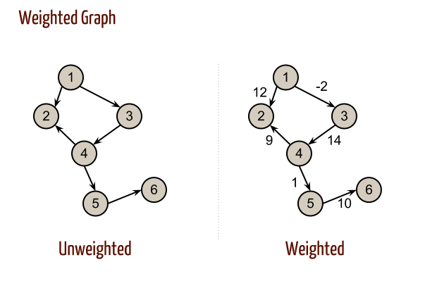
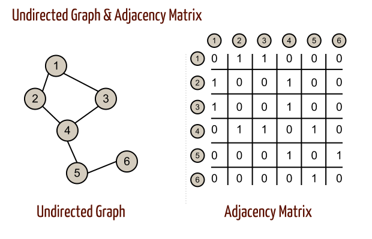
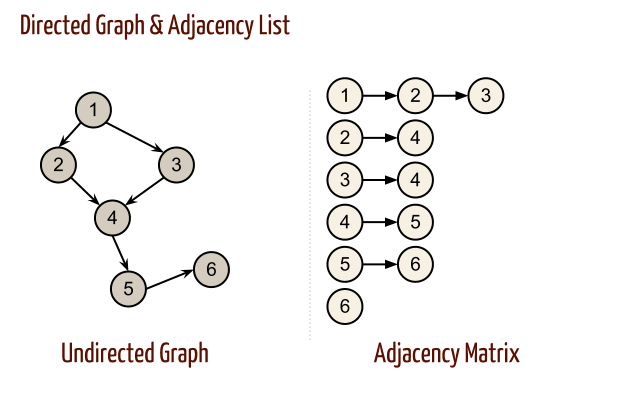

# Knowledge Representation

## Objectives

* Data structures review
* Runtime analysis review
* Knowledge representation meaning
* Graph as data structure
* Homework 1 announcement

## Metrics/Desired Outcomes

* Complexity analysis (space and/or time)
* Understanding Graph as data structure
* Using graph for general problem solving
* Basic graph traversal (overview)

### Data structures intro

Today, we're going to review all about data structures.

OoohhhhoooOOOhhhh, **soo** exciting? Right?

Yeah, data structures are usually not a fun topic out there, but they are
important. Not just to pass this class, but in order to be a better software
engineer.

For example, knowing data structure can help you to:

* Manage complexity and make your programs easier to follow
* Build high-performance, memory-efficient programs

Using myself at work for example, when I need to improve performance of the
legacy system. I need to do some runtime analysis and its data structure usage.
It is confusing when the legacy program doesn't use any data structure nor
implement any common algorithm or patterns. It's extremely hard to read and
understand thus hard to maintain.

In order to learn about the data structure, we will be going through some
implementation of them together. And you will get to implement the core data
structure -- Graph -- yourself!

### What are data structure?

Data structures are different methods to store and organize data that serve
different requirements.

Depends on what data you have and how you plan to use it, one data structure will
be a better choice than the others.

To understand why, we will be talking about algorithms -- step-by-step sets of
operations to be performed.

You can think of algorithms like formulas to software development in very high
level point of view.

Data structures and algorithms are often implemented together. To implement
algorithm, you will need data structure. And to implement data structure, you
will implement detail in algorithm!

Going back to earlier analogy about algorithms being formulas to software
development, you can think of the data structures as the terms used to abstract
complexity behind.

For example, there are absurd number of algorithms to sort a set of unordered items.

Some of these are faster than others in certain situation. Some use less memory.
Some are easy to implement.

Each one of them are better for *something*. So your job as software engineer is
to make a decision based on what you need. And you will need a way to compare them,
a way to measure them (runtime analysis).

Yay! Our favorite "Big-O" notation will come back to haunt you down after your
CS-312 class before! (Remember the good ol' Master Theorem from final?)

### Big-O Notations

Roughly speaking, Big-O Notation is a way to measure the performance of algorithms
in order to compare one against another when discussing them (or at least for
our purpose).

In summary, Big-O is to classify algorithms by how they perform to number (N)
of items that you give them.

You usually measure two things with Big-O:

* Time complexity
* Space complexity

We measure these two independently because while an algorithm may perform with
less time cost, it may take way more memory!

Recall some common Big-O's:

| Name | Notation | How you feel when they show up at your party |
| :-- | :-- | :-- |
| Constant | O(1) | AWESOME!! |
| Logarithmic | O(log N) | GREAT! |
| Linear | O(N) | Okay. |
| Linearithmic | O(N log N) | Ugh ... |
| Polynomial | O(N ^ 2) | Shitty |
| Exponential | O(2 ^ N) | Horrible |
| Factorial | O(N!) | WTF |

Compare them in a visual way:


So how does Big-O notation help us?

With data structures, you can perform 4 primary types of
actions: Accessing, Searching, Inserting, and Deleting.

It's important for you to note that data structures may be good at one action but bad at other.

| Data structure | Accessing | Searching | Inserting | Deleting |
| :-- | :-- | :-- | :-- | :-- |
| Array | O(1) | O(N) | O(N) | O(N) |
| Linked List | O(N) | O(N) | O(1) | O(1) |
| Binary Search Tree | O(log N) | O(log N) | O(log N) | O(log N) |

Even further, some actions will have a different "average" performance and a "worst case scenario" performance.

There is no silver bullet when choosing data structures, and you can certainly choose one over the other based on the data you are working with and the way you perform with it. This is why it's important to know a number of different common data structures so you can have choices.

### Memory

Memory is pretty boring, it's just bunch of ordered slots where you can store information. You hold onto memory address in order to find information.

Let's imagine a chunk of memory like this:

```
Values:    |1001|1011|1000|0100|1010|0101|0010|0001|1111|0000...
Addresses: 0    1    2    3    4    5    6    7    8    9    ...
```

If you've ever wondered why programming-friendly indexes are zero-indexed, it's because of the way memory works. If you want to read the first chunk of memory, you read from 0 to 1.

Computer memory is a bit like the wild west, every program running on your machine is store within this same *physical* data structure. Without layers of abstraction over it, it would be extremely difficult to use.

The these abstractions serve two additional purposes:

* Store data in memory in a way that is more efficient and/or faster to work with
* Store data in memory in a way that makes it easier to use

From here, we will be going over some basic implementation of data structure. Starting with List, Hash Tables to Graph.

#### List

```js
class List {
  constructor() {
    this.memory = [];
    // we store the length separately because in real life
    // the "memory" doesn't have a length you can read from
    this.length = 0;
  }

  get(address) {
    return this.memory[address];
  }

  push(value) {
    this.memory[this.length] = value;
    this.length ++;
  }

  pop() {
    if (this.length === 0) return;

    var lastAddress = this.length - 1;
    var value = this.memory[lastAddress];
    delete this.memory[lastAddress];
    this.length --;

    return value;
  }

  // push item to beginning of the list
  unshift(value) {
    var previous = value;

    for (var address = 0; address < this.length; address ++) {
      var current = this.memory[address];
      this.memory[address] = previous;
      previous = current;
    }

    this.memory[this.length] = previous;
    this.length++;
  }

  // pop first item out of list
  shift() {
    if (this.length === 0) return;

    var value = this.memory[0];

    for (var address = 0; address < this.length; address ++) {
      this.memory[address] = this.memory[address + 1];
    }

    delete.this.memory[this.length - 1];
    this.length --;
  }

  return value;
}
```

#### Hash table

```js
class HashTable {
  constructor() {
    this.memory = [];
  }

  hashKey(key) {
    var hash = 0;
    for (var index = 0; index < key.length; index ++) {
      var code = key.charCodeAt(index);
      // yay, magic!
      hash = ((hash << 5) - hash) + code | 0;
    }
    return hash;
  }

  get(key) {
    var address = this.hashKey(key);
    return this.memory[address];
  }

  set(key, value) {
    var address = this.hashKey(key);
    this.memory[address] = value;
  }

  remove(key) {
    var address = this.hashKey(key);
    if (this.memory[address]) {
      delete this.memory[address];
    }
  }
}
```

#### Graph

```js
class Graph {
  constructor() {
    // to demonstrate graph, we will be using objected oriented approach
    this.nodes = [];
  }

  addNode(value) {
    this.nodes.push({
      value: value,
      lines: []
    });
  }

  find(value) {
    return this.nodes.find(function(node) {
      return node.value === value;
    });
  }

  addLine(startValue, endValue) {
    var startNode = this.find(startValue);
    var endNode = this.find(endValue);

    if (!startNode || !endNode) {
      throw new Error('Both nodes need to exist');
    }

    startNode.lines.push(endNode);
  }
}
```

Reference on the data structure overview: https://github.com/thejameskyle/itsy-bitsy-data-structures/blob/master/itsy-bitsy-data-structures.js

That is enough of the data structure and why we need to learn them.

### Graph Components

We want to talk about graph and understand the different terminologies of Graph


* Node (Sometimes called Vertex)
* Edge
* Graph

Always, node will hold some values (can be a simple String, Integer, or custom
data). But doesn't matter what data a node is holding, node is node and edge is
edge. And Graph will contain nodes and edges with their relationships.

### Methods

When using graph as data structure, there are some common methods in graph.

* Add/remove node
* Add/remove edge between nodes
* Find node (if there is any)
* Adjacent
* Neighbors
* Distance

### Examples

Why do we need to learn all about Graph again? How is this useful to us?

Graph can be used for many different cases:

* Social network
* Map/city (locations)
* Game States
* More depends on how abstract you can get

### Types of Graphs


Graph has different types such as below:

* Directed/Undirected
  * 
* Weighted
  * 
* Dense/Sparse

> Dense graph: graph has a lot more edges than vertices (defined as `|E| = O(|V|)` where |E| is number of edges and |V| is number of vertices)  
> Sparse graph: graph has relative fewer edges than vertices (defined as `|E| = Θ(|V^2|)`)


### Graph as Abstract Data Structure

#### 3 ways to represent graph in programming

1. Adjacency Matrix
  * 
2. Adjacency List
  * 
3. Object Oriented (objects and pointers)


> With the complexity analysis below, be sure to know pros and cons for each one

#### Complexity Analysis

| \ | Adjacency List | Adjacency Matrix | Object Oriented |
| :-- | :-- | :-- | :-- |
| Store graph | O(&#124;V&#124; + &#124;E&#124;) | O(&#124;V&#124;<sup>2</sup>) | Depends |
| Add vertex | O(1) | O(&#124;V&#124;<sup>2</sup>) | Depends |
| Add edge | O(1) | O(1) | Depends |
| Remove vertex | O(&#124;E&#124;) | O(&#124;V&#124;<sup>2</sup>) | Depends |
| Remove edge | O(&#124;E&#124;) | O(1) | Depends |
| Query | O(&#124;V&#124;) | O(1) | Depends |
| Remarks | Slow to remove vertices and edges, because it needs to find all vertices or edges | Slow to add or remove vertices, because matrix must be re-sized/copied | Readable and convenient for OOP(Object Oriented Programming) background users |

Reference: [Wikipedia - Abstract data structure][wiki-graph]

### Graph Traversal Algorithms Overview

* **Breadth First Search** (BFS)
* **Depth First Search** (DFS)
* A-star
* Dijkstra
* Alpha-beta
* Min-max

## Learning

### [Design Pattern][design-pattern] in action

* Strategy pattern (Representation interface)
* Factory pattern (again Representation interface with static `of` method)

### [Homework 1](homeworks/homework1.md)

Finish remaining code for graph package


[wiki-graph]: https://en.wikipedia.org/wiki/Graph_(abstract_data_type)
[design-pattern]: https://github.com/iluwatar/java-design-patterns
